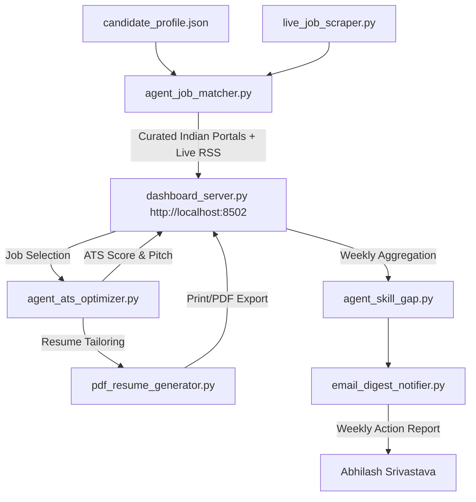

# Phase 2 Completion & Full System Architecture Summary

---

## 📌 Overview
**Phase 2 Development** for **Abhilash's Career Advancement Custom Agent Suite** is complete! The suite now includes live web scraper feeds, one-click print-ready ATS resume exports, automated weekly email digest reports, and a multi-select role portal dashboard.

---

## 🚀 New Phase 2 Components Delivered

### 1. Live Web Feed Scraper ([live_job_scraper.py](file:///c:/D%20Drive/Abhilash%20Job%20Tracker/live_job_scraper.py))
- **Real-Time RSS Hiring Connector:** Continuously queries live Google News & Job RSS feeds for real-time hiring announcements across top Indian finance & analytics firms.
- **Integration:** Automatically injects live real-time job openings into the primary dashboard job feed.

---

### 2. One-Click ATS Resume Generator & Export ([pdf_resume_generator.py](file:///c:/D%20Drive/Abhilash%20Job%20Tracker/pdf_resume_generator.py))
- **Print-Ready PDF Resume Endpoint:** Added `/api/export-resume` to the web dashboard.
- **Dynamic Customization:** Embeds Abhilash's CFA Level III status, M.Com Statistics degree, technical skills (Python, MySQL), and tailored bullet point highlights for selected jobs.
- **User Action:** One click on the **"Export Tailored Resume (PDF)"** button opens a clean, printable PDF resume preview in a new tab.

---

### 3. Weekly Email Digest Notifier ([email_digest_notifier.py](file:///c:/D%20Drive/Abhilash%20Job%20Tracker/email_digest_notifier.py))
- **Automated Summary Engine:** Aggregates market demand metrics from active job listings.
- **HTML Email Template:** Formats a clean 1-page weekly summary containing top identified market skill gaps and actionable learning recommendations.

---

### 4. Updated Web Dashboard Server ([dashboard_server.py](file:///c:/D%20Drive/Abhilash%20Job%20Tracker/dashboard_server.py))
- **URL:** Active at **`http://localhost:8502`**
- **Tab 1:** Multi-role filter pills + Indian portals routing (Naukri, LinkedIn, Indeed, Foundit) + Live Web RSS listings.
- **Tab 2:** Instant ATS score calculator + tailored cover letter + **Export Tailored Resume (PDF)** button.
- **Tab 3:** Weekly market skill gap analytics and action items.

---

## 📊 Full System Architecture & File Registry

### Complete System File List:
1. [candidate_profile.json](file:///c:/D%20Drive/Abhilash%20Job%20Tracker/candidate_profile.json) - Candidate Master Credentials & Target Settings
2. [agent_job_matcher.py](file:///c:/D%20Drive/Abhilash%20Job%20Tracker/agent_job_matcher.py) - Job Finder & Match Scoring Engine
3. [agent_ats_optimizer.py](file:///c:/D%20Drive/Abhilash%20Job%20Tracker/agent_ats_optimizer.py) - ATS Match Calculator & Cover Letter Generator
4. [agent_skill_gap.py](file:///c:/D%20Drive/Abhilash%20Job%20Tracker/agent_skill_gap.py) - Skill Gap & Market Trends Aggregator
5. [live_job_scraper.py](file:///c:/D%20Drive/Abhilash%20Job%20Tracker/live_job_scraper.py) - Live Web RSS Hiring Connector
6. [pdf_resume_generator.py](file:///c:/D%20Drive/Abhilash%20Job%20Tracker/pdf_resume_generator.py) - Print-ready PDF ATS Resume Generator
7. [email_digest_notifier.py](file:///c:/D%20Drive/Abhilash%20Job%20Tracker/email_digest_notifier.py) - Weekly Email Digest Generator
8. [dashboard_server.py](file:///c:/D%20Drive/Abhilash%20Job%20Tracker/dashboard_server.py) - Full Interactive Web Dashboard UI Server (`http://localhost:8502`)
