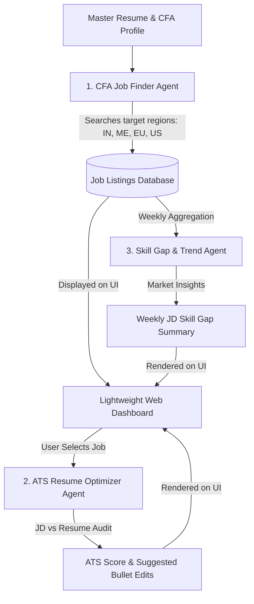

# Project Plan: Career Advancement Custom Agent Suite for Abhilash

---

## 🎯 Project Overview
The goal of this project is to build an intelligent, automated assistant (a suite of AI agents) tailored specifically for **Abhilash B. Srivastava** (CFA Level III cleared, M.Com Statistics, BBA Finance, skilled in Python, MySQL, Financial & Quantitative Analysis).

This suite will act as a personal career advisor and job application co-pilot to help Abhilash land high-impact roles aligned with his core **CFA competencies** across targeted global regions.

---

## 🏗️ Core Features & Breakdown

### Feature 1: Intelligent Job Finder & Matcher (Agent 1)
* **What it does:** Searches and filters job openings across major job boards and corporate career pages based on CFA-centric qualifications.
* **Core Competency Alignment (CFA-focused):**
  * Investment Analysis, Equity/Fixed Income Research, Portfolio Management & Asset Management.
  * Quantitative Finance, Risk Management, Corporate Finance, Valuation & Financial Analytics.
* **Target Geographic Regions (Prioritized):**
  1. **India** (Mumbai, Bangalore, NCR, Gujarat, Remote/Hybrid)
  2. **Middle East** (Dubai/UAE, Riyadh/Saudi Arabia, Qatar)
  3. **Europe** (UK/London, Frankfurt, Zurich, Amsterdam)
  4. **US** (New York, Boston, Chicago, Remote)
* **Output:** Clean, sorted table of top matching jobs with an overall **Fit Score (%)**.

---

### Feature 2: ATS Resume Optimizer & Application Assistant (Agent 2)
* **What it does:** When Abhilash selects a specific job opening from the dashboard, this agent compares his master resume against the job description (JD).
* **Key Actions:**
  * **ATS Score Check:** Calculates exact ATS compatibility percentage and missing key industry terms.
  * **Tailored Bullet-Point Edits:** Suggests exact wording modifications, metric additions, and skill highlights to maximize ATS ranking without inflating claims.
  * **Custom Cover Letter & Pitch Generator:** Generates a tailored cover letter emphasizing his CFA Level III achievement, statistical foundation, and relevant practical projects.

---

### Feature 3: Skill Gap Analysis & Weekly Progress Tracker (Agent 3)
* **What it does:** Aggregates market data on a weekly basis from all scraped JDs in target regions.
* **Key Actions:**
  * **Skill Gap Identification:** Identifies emerging high-demand skills/tools requested in top CFA/Finance jobs that are currently light on his profile (e.g., Financial Modeling, Power BI/Tableau, Advanced Econometrics).
  * **Weekly Actionable Plan:** Delivers a simple, 1-page weekly summary with clear recommendations (e.g., "Build a sample DCF valuation model in Python to bridge the gap for 40% of target Investment Analyst roles").

---

## 💻 User Interface (Lightweight Web Dashboard)
We will build a simple, modern, lightweight Web Dashboard (using Streamlit / Flask + Tailwind HTML) containing:
1. **Jobs Feed Tab:** Interactive table showing matched jobs with filters (Region, Role Type, Remote/Onsite).
2. **Resume Optimizer Tab:** Paste/Select a job, upload/select resume, view instant ATS score + suggested bullet-point changes.
3. **Weekly Insights Tab:** View weekly skill gap analytics, trending JD terms, and recommended action steps.

---

## 🛠️ System Architecture & Workflow

---

## 🗓️ Implementation Roadmap

### Phase 1: Core Configuration & Master Profile Ingestion
- Extract structured master profile data (CFA Level III, M.Com Stats, BBA Finance, Python/MySQL, research project details).
- Define search keyword taxonomies (CFA Level 3, Investment Analyst, Asset Management, Quant Analyst, Equity Research, Corporate Finance).

### Phase 2: Building Agent 1 (CFA Job Matcher)
- Implement search/scraping workflows targeting India, Middle East, Europe, and US markets.
- Build match-scoring engine based on CFA competencies and qualifications.

### Phase 3: Building Agent 2 (ATS Resume Optimizer)
- Build ATS keyword matching parser and diff engine.
- Create structured prompt pipeline for bullet-point recommendations and cover letter generation.

### Phase 4: Building Agent 3 (Weekly Skill Gap Tracker)
- Build aggregation pipeline to scan recurring job requirement terms.
- Generate weekly skill gap analysis reports.

### Phase 5: Web Dashboard Development & Launch
- Develop and launch the lightweight web dashboard (Streamlit / modern web interface).
- End-to-end integration and testing with live job search data.
